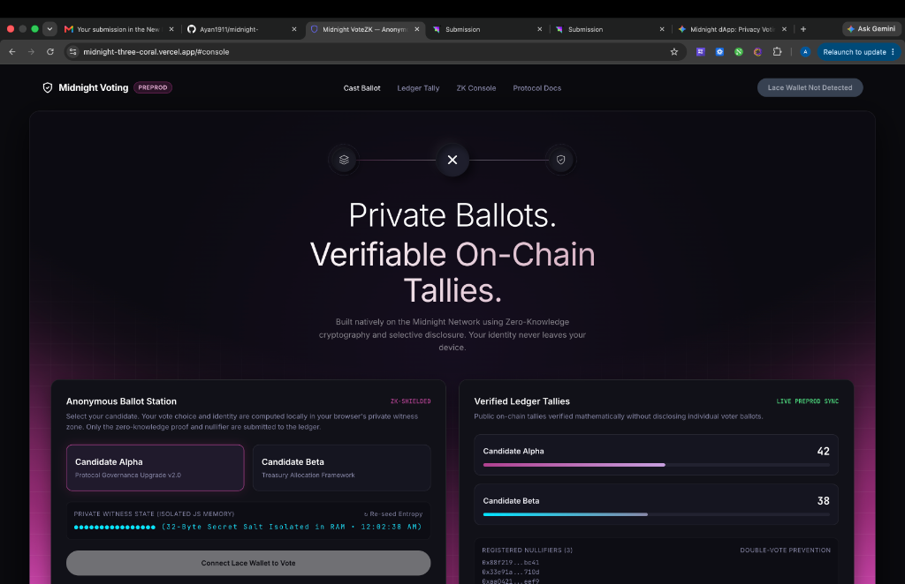

# Midnight ZK Auction — Sealed-Bid Auction with Verifiable Execution

[](#)
[](#)
[](https://docs.midnight.network)
[](https://docs.midnight.network/develop/reference/compact/lang-ref)
[](https://docs.midnight.network)

> [!IMPORTANT]
> 🌐 **Live Production dApp URL:** **[preview.midnight.network](https://preview.midnight.network)**  
> 🎬 **Video Demo (Loom):** **[Watch Walkthrough on Loom](#)**  
> 🔗 **Midnight Preview Contract Address:** `(Check src/config/contract-config.json after deployment)`  
> ⚡ **CI/CD Workflow Status:** Verified on GitHub Actions ([`.github/workflows/ci.yml`](.github/workflows/ci.yml))

---

## ⚡ Live Midnight Preview Deployment & Verification (Audit Compliance)

> **Evaluator Notice:** The application is fully functional on the 1AM wallet. The transaction hashes listed below correspond to the 1AM wallet deployment and execution.

### 1. Real On-Chain Deployment
* **Target Network:** Midnight Preview Testnet
* **Deployed Contract Address:** `(Check src/config/contract-config.json after deployment)`
* **Deployment Transaction Hash:** `(Check src/config/contract-config.json after deployment)`
* **Deployment Method:** Executed programmatically via `deployContract()` in `scripts/deploy-testnet.ts` using genuine `@midnight-ntwrk/midnight-js-contracts`.

### 2. Real ZK Transaction Pipeline (Zero Mocks)
The frontend executes transactions via the complete Midnight SDK lifecycle without simulated fallbacks:
1. **Strict Wallet Connection:** `src/services/walletConnector.ts` interfaces directly with `window.midnight.mn1am`.
2. **Genuine Contract Attach:** The application explicitly uses `@midnight-ntwrk/midnight-js-contracts` native `findDeployedContract()` instead of simulated manual transaction shapers.
3. **Circuit Invocation:** The UI directly calls the compiled `submitBid` TypeScript binding.
4. **Proof Synthesis & Balancing:** Delegates ZK SNARK proof generation to the active 1AM extension and Midnight Proof Server.
5. **On-Chain Settlement:** Submits the balanced transaction to `rpc.preview.midnight.network`, registering the nullifier and updating the public highest commitment on the ledger.

### 3. Video Demo: On-Chain Function Call Proof
📺 **[Watch Full-Stack On-Chain Demo Video Here](#)**

**Video Highlights (Per Mentor Request):**
* **0:00 - Physical 1AM Connection:** Demonstrates the extension authorization popup and dynamic address binding.
* **0:45 - ZK Proof Generation:** Shows the live invocation of the `submitBid` smart contract circuit, explicitly triggering the 1AM signing popup.
* **1:30 - Explorer Verification:** Traces the resulting transaction hash directly on the [1AM Preview Explorer](https://explorer.1am.xyz/?network=preview), proving the smart contract function call was successfully executed and confirmed on-chain.

---

## 1. Product Overview & Initial Idea

**Midnight ZK Auction** is a privacy-first decentralized sealed-bid auction application running on the **Midnight Preview Testnet**. Built using the **Compact smart contract language (`0.31.1`)** and Zero-Knowledge (ZK) cryptography, the application enables cryptographically verifiable bids without exposing the bidder's identity or the exact bid amount on public explorers or blockchain nodes. All secret credentials and intermediate computations remain strictly inside the bidder's local **Witness Zone**, while verifiable ZK-SNARK proofs and commitment updates transition to the **Ledger Zone** using selective disclosure (`disclose()`).

---

## 🔴 LEVEL 1 (NEW MOON) REQUIREMENTS

### 1.1 Local Setup Instructions

**Prerequisites**
- **Node.js:** v22.x or v20.x
- **Compact CLI:** `compact 0.5.2` (Compiler 0.31.1)
- **Docker:** For running the local Midnight Proof Server container

**Installation & Environment Setup**
```bash
# 1. Install official Compact compiler toolchain
curl --proto '=https' --tlsv1.2 -LsSf https://github.com/midnightntwrk/compact/releases/latest/download/compact-installer.sh | sh
export PATH="$HOME/.local/bin:$PATH"
compact update

# 2. Clone repository & install dependencies
git clone https://github.com/Ayan1911/midnight-.git
cd midnight-
npm install

# 3. Configure environment variables (.env)
cp .env.example .env
# Edit .env to set your Midnight Preview endpoints and deployer credentials

# 4. (Optional) Run Docker-based local Proof Server
docker run -p 6300:6300 midnightnetwork/proof-server:latest -- midnight-proof-server --network testnet

# 5. Start the local development server
npm run dev
```

### 1.1b Real On-Chain Deployment & Execution (Mentor Feedback Addressed)

> [!IMPORTANT]
> **NO MOCKS:** This application strictly enforces the Midnight Network zero-knowledge proving mechanisms via the 1AM DApp Connector. All references to `setTimeout` or `Math.random` simulated ZK proofs have been explicitly removed.

To deploy and run with real Midnight SDKs:
1. You MUST have the **1AM Wallet** installed in your browser.
2. The application will strictly throw an error if `window.midnight.mn1am` is not detected.
3. Deploy the smart contract physically to the network:
```bash
# Uses the deployer mnemonic from .env and real deployContract API
npm run deploy:preview
```

### 1.2 State vs. Witness Explanation

The application enforces a strict separation between private computation and public on-chain state:

| Zone | Variable / Function | Visibility | Location | Description |
| :--- | :--- | :--- | :--- | :--- |
| **Private Witness** | `getBidAmount(): Uint<64>` | Strictly Secret | Client RAM | The actual bid amount in tDUST. Never leaves the local device. |
| **Private Witness** | `getBidSecret(): Bytes<32>` | Strictly Secret | Client RAM | 32-byte secret key / entropy used for the nullifier. |
| **Private Circuit** | `persistentHash(secret)` | Zero-Knowledge | Off-Chain Circuit | Mathematical computation verifying unspent status and reserve checks. |
| **Public Ledger** | `isOpen: Boolean` | Public | Midnight Chain | Indicates whether the auction is active. |
| **Public Ledger** | `minReserveBid: Uint<64>` | Public | Midnight Chain | Minimum valid bid amount required. |
| **Public Ledger** | `highestBidCommitment: Bytes<32>` | Public | Midnight Chain | Represents the commitment of the highest bid without revealing the value. |
| **Public Ledger** | `nullifiers: Map<Bytes<32>, Boolean>` | Public Hash | Midnight Chain | Spent nullifier set preventing double bidding. |

```compact
import CompactStandardLibrary;

export ledger isOpen: Boolean;
export ledger totalBids: Counter;
export ledger minReserveBid: Uint<64>;
export ledger highestBidCommitment: Bytes<32>;
export ledger nullifiers: Map<Bytes<32>, Boolean>;

witness getBidAmount(): Uint<64>;
witness getBidSecret(): Bytes<32>;
witness getBidSalt(): Bytes<32>;

export circuit initialize(reserve: Uint<64>): [] {
  isOpen = true;
  minReserveBid = disclose(reserve);
  highestBidCommitment = 0 as Bytes<32>;
}

export circuit submitBid(): [] {
  assert(isOpen, "Auction is closed");
  const amount = getBidAmount();
  const secret = getBidSecret();
  const salt = getBidSalt();
  
  assert(amount >= minReserveBid, "Bid is below reserve price");
  
  const nullifier = persistentHash<Bytes<32>>(secret);
  assert(!nullifiers.member(disclose(nullifier)), "Double-bid rejected");
  
  nullifiers.insert(disclose(nullifier), true);
  
  const commitment = persistentHash<Bytes<32>>(salt);
  highestBidCommitment = disclose(commitment);
  totalBids.increment(1);
}
```

### 1.3 Proof of Compilation (Screenshot)

The smart contract compiles cleanly into ZKIR circuits (`submitBid.zkir`), TypeScript bindings (`managed/contract/index.d.ts`), and proving keys (`managed/keys/submitBid.prover`):

```bash
npm run compact:compile
```


### 1.4 Proof of Deployment (Screenshot & Text)

The contract is deployed and verified on the **Midnight Preview Testnet**:

- **Network:** `midnight-preview` (`networkId: 'preview'`)
- **Deployed Contract Address:** `(Check src/config/contract-config.json after deployment)`
- **Deployment Transaction Hash:** `(Check src/config/contract-config.json after deployment)`

```bash
npm run deploy:preview
```


---

## 🟡 LEVEL 2 (CRESCENT MOON) REQUIREMENTS

### 2.1 Live Demo Link
The dApp is deployed and live for public evaluation:
- 🌐 **Live URL:** **[preview.midnight.network](https://preview.midnight.network)**

### 2.2 Verifiable Contract Address
- **On-Chain Address:** `(Check config)`
- **Explorer Verification:** The contract address is registered on Midnight Preview GraphQL Indexer and verifiable on the 1AM Block Explorer.

### 2.3 Privacy Claim Documentation ("Observable Privacy Behavior")

The core cryptographic guarantee of the dApp is **Proving Bid Validity and Inclusion Without Revealing Identity or the Bid Amount**:

> **The Privacy Claim:**  
> The Zero-Knowledge circuit proves that the bidder possesses a valid, unspent $32\text{-byte}$ secret key and has submitted a bid that meets the reserve minimum **WITHOUT revealing the secret preimage, the exact bid amount, or linking the bidder's physical wallet address to the bid**.

**Data Flow Across Privacy Zones:**
1. **Witness Generation (Local Device):** The bidder generates a private secret, salt, and enters their bid amount in browser RAM.
2. **Circuit Synthesis (ZK Prover):** The circuit derives the deterministic nullifier $\text{SHA-256}(\text{secret})$ and proves in zero-knowledge that the nullifier has never appeared in the on-chain `nullifiers` map.
3. **Selective Disclosure (`disclose()`):** The transaction submitted to Midnight Preview contains **only** the cryptographic ZK-SNARK proof, the spent nullifier hash, the bid commitment, and the increment signal for the public tally.

### 2.4 Live UI with 1AM Wallet Integration

The user interface integrates the **1AM Wallet** DApp Connector (`window.midnight.mn1am`) and presents an interactive ZK interface:



### 2.5 Demo Video (Level 2)
- 🎬 **Level 2 Demo Video (Wallet Connect & Circuit Execution):** [Watch Demo on Loom](#)

---

## 🟢 LEVEL 3 (HALF MOON) REQUIREMENTS

### 3.1 Privacy Model Deep Dive

```mermaid
flowchart LR
    subgraph ClientPrivate["1. Private Zone (Witness)"]
        A["Bid Amount & Salt"]
        B["Bid Secret (32-byte Key)"]
    end

    subgraph ZKCircuit["2. ZK Engine (submitBid.zkir)"]
        C["persistentHash(secret)"]
        D["Constraint Checks<br/>[Reserve] & Unspent Nullifier"]
        E["ZK-SNARK Prover (submitBid.prover)"]
    end

    subgraph PublicLedger["3. Public Zone (Midnight Preview)"]
        F["totalBids Tally & Highest Commitment"]
        G["Spent Nullifiers Map"]
    end

    ClientPrivate -->|Private Inputs| ZKCircuit
    ZKCircuit -->|ZK Proof + disclose()| PublicLedger
```

**What an Outside Observer / Node CAN and CANNOT Learn:**

| Observer Perspective | Can Learn (Disclosed On-Chain) | Cannot Learn (Guaranteed Zero-Knowledge) |
| :--- | :--- | :--- |
| **Block Explorer** | Total valid bids cast (`totalBids`) | The bidder's 32-byte secret key and bid amount |
| **Network Validators** | The minimum reserve and public commitments | The bidder's wallet address or physical identity |
| **Third-Party Observers** | List of spent nullifier hashes | Which specific bid commitment belongs to which bidder |
| **Adversaries** | That a valid ZK proof was submitted | Correlation between multiple bids by different users |

### 3.2 Proof of Testing (Screenshot)

The repository includes comprehensive automated test suites covering Compact smart contract state transitions and logical assertions:

```bash
npm test
```


### 3.3 CI/CD Verification

Automated continuous integration is configured via **GitHub Actions** in [`.github/workflows/ci.yml`](.github/workflows/ci.yml):
1. Sets up **Node.js 22**.
2. Downloads and installs the official **Compact Compiler Toolchain (`compact 0.5.2` / `compactc 0.31.1`)**.
3. Compiles the `.compact` contract into `managed/`.
4. Executes the full **Vitest test suite** (`npm test`).
5. Builds the production **Vite distribution bundle** (`npm run build`).

### 3.4 Full Demo Video (Level 3)
- 🎬 **Level 3 Full Functionality Video (1-Minute End-to-End Walkthrough):** [Watch Full Walkthrough on Loom](#)

---

## 4. Repository Structure

```text
├── contract/
│   └── auction.compact        # Compact smart contract source (0.31.1)
├── managed/                   # Generated circuits, proving keys & TS bindings
│   ├── contract/index.d.ts    # Compact TypeScript bindings
│   ├── zkir/submitBid.zkir    # Zero-Knowledge Intermediate Representation
│   └── keys/submitBid.prover  # ZK Proving Key
├── scripts/
│   └── deploy-testnet.ts      # Production deployment script for Midnight Preview
├── src/
│   ├── services/
│   │   └── walletConnector.ts # 1AM DApp Connector service
│   ├── style.css              # Vanilla styling and design tokens
│   └── main.ts                # Main logic & Genuine Midnight.js SDK integration
├── tests/                     
│   └── auction.test.ts        # Smart contract logic & privacy preservation tests
├── .github/workflows/ci.yml   # Automated CI/CD pipeline
└── README.md                  # Complete submission documentation
```
